.. _section-configuration-game-admin-smartgrid-game:

Design the Smart Grid Game
==========================

About the Smart Grid Game
-------------------------

Makahiki provides the Smart Grid Game (SGG) to support "gamified" delivery of educational
experiences.  Players use its grid interface to discover "actions" they can
perform. Successful completion of an action earns the player a variable number of points
depending upon the difficulty of the action, and can potentially "unlock" additional actions in the
SGG.  There are five types of actions: activities, commitments, events, excursions, and
creative.  As a challenge designer, your task is to design an SGG that contains
educational experiences suitable for your players, and also design the "path" that players
take through the SGG through the unlocking of new actions.

The following screen image shows a typical Smart Grid Game interface for players:

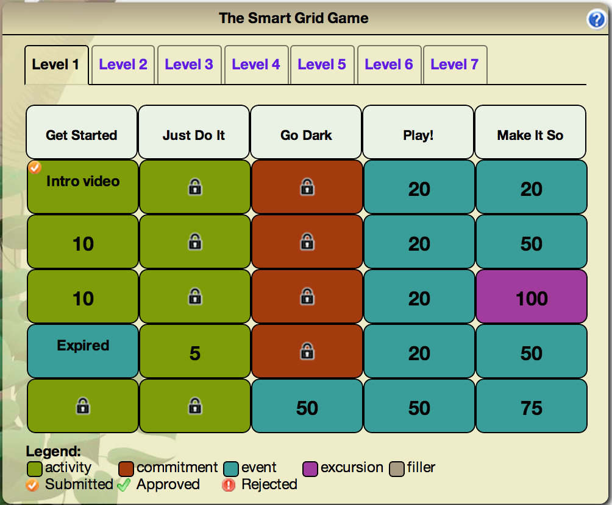

This image reveals several important aspects of the SGG:

**Levels.** Each Smart Grid Game can have from 1 to 7 "Levels". (More than 7 Levels
becomes awkward when viewing the game on a mobile device.) The screen image above
has 7 levels. In typical SGG designs, players begin with access only to the first Level.
Higher Levels become unlocked for a player either because they completed a lower level or 
because a Level is designed to unlock automatically when a given date is reached during
the challenge.

**Categories.** Each Level of a Smart Grid Game has a set of columns, labelled with a name
called its "category".  In this screen image, the first category is "Get Started",
and there are five categories total.  For best viewing on a mobile device, we recommend no
more than 5 categories (as in this screen image).  Levels can have differing numbers of
categories. 

**Actions.** The cells underneath a category label provide access to "Actions".  There are
several action types: Activity, Commitment, Event, Excursion, Video.  The color of the
cells indicates their action type.  In the screen image, each of the five categories has
five Action cells, so this Level of this Smart Grid Game has a total of 25 Actions.  In
order to create a rectangular grid, designers can also create "filler" actions, which
occupy a space in the grid but cannot be otherwise manipulated by players.  There are no
"filler" actions in the above example, but the legend shows that they would be colored
gray if one or more were present.

**State of play.** Cells are "decorated" with information that indicates the state of
play.   

  * If an action is unlocked and thus available for the player, then the cell provides
    a number indicating the point value of that action if completed. In the image above,
    unlocked cells indicate actions ranging in value from 5 to 100 points.  

  * If an action is not yet unlocked, then instead of a number, it shows a lock icon.  

  * If the cell corresponds to an an event or excursion that has already occurred, it is
    labeled as "Expired".  

  * If the action has been submitted or completed by the player, then instead of a point value, the
    name of the action appears in the cell.  For example, the image above shows that this
    player has completed the "Intro Video" action. 

  * Finally, actions are typically in one of three states: submitted, completed, or
    rejected (in which case the player can resubmit a revised answer to get full credit.)
    Small icons (orange, green, or red) indicate this state. 

About actions
------------- 

Activity
********

**Activities** are the most basic action available in the Smart Grid. In order to get points
for an activity, a player must input a response to the system, which is reviewed and
approved or disapproved by administrators. These responses
can be a short textual answer or an uploaded picture. If a submission is
approved, the player receives the points for their submission. Otherwise, the system
notifies the player that their submission was not approved,
along with a comment (writte by an administrator) explaining why it was rejected. The player can
change and resubmit their response and still earn the full point value for that task. The
following figure illustrates a sample activity:

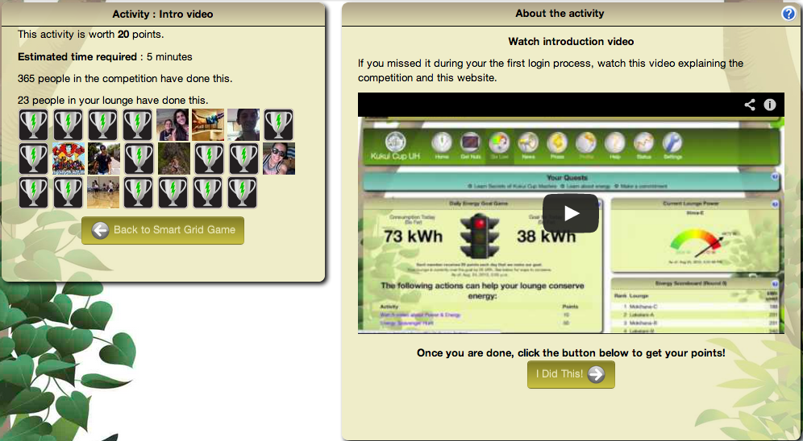

   *Sample activity in the Smart Grid Game*

Commitment
**********

**Commitments** are pledges that the player will carry out a specific action for a
specific amount of time (typically 5 days). Examples include: reducing shower time, taking
the stairs, and turning off the lights when leaving a room. Unlike activities, commitments
are not easily verifiable, and so they are usually designed with fewer points than
activities. Furthermore, a player can only enter into five commitments at any given
time. After the commitment period is up, the player can declare that they completed the
commitment and immediately earn the associated points. They can then enter into another
commitment, including the one they just completed.  The following figure illustrates a
sample commitment:

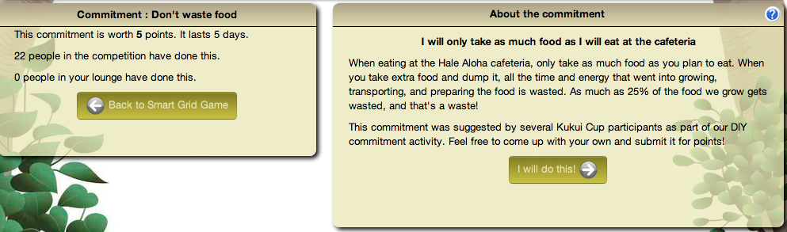

   *Sample commitment in the Smart Grid Game*

Events and Excursions
*********************

**Events and excursions** are actions tied to real world meetings. Events are typically
held in or near the challenge location while excursions typically require
transportation. To help organizers gauge interest in events and excursions, players can
earn points by signing up in advance. Players that do this (and then actually attend the
event or excursion) earn a signup bonus (typically 2 points). Players can also set up a
reminder that is sent to their email and/or their mobile phone before the meeting takes
place. At the event or excursion, a challenge administrator provides players with
"attendance codes" printed on slips of paper that can be later entered in the system by
the player to get their points.  (The paper slips provide a form of verification that the
player physically attended the event or excursion.)  Attendance codes are generated by
Makahiki and can only be used once. To discourage players from signing up and not
attending, a penalty (typically 2 points) is assessed to players who do not submit an
attendance code. If the player submits an attendance code for the event after receiving
this penalty, the penalty is reversed.  The following figure illustrates a sample event:

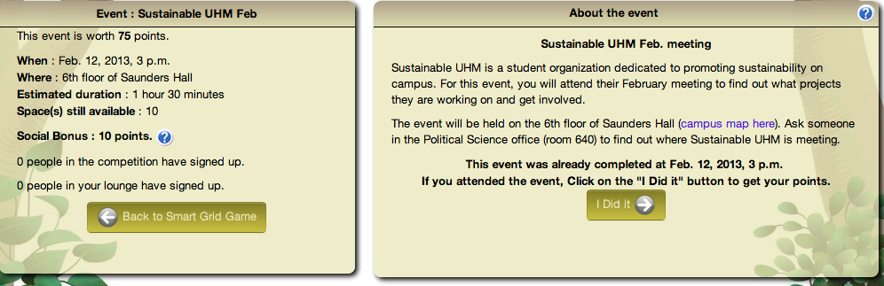

   *Sample event in the Smart Grid Game*

Creative
********

**Creative actions** enable players to exercise their artistic talents.  These are often worth a
variable number of points, depending upon the effort made by the player and the quality of
the outcome (as judged by administrators).  Examples of creative activities include: make
a poem, make a video, write a letter to the editor, write a song, and create a photo
blog. The following figure illustrates a creative activity:

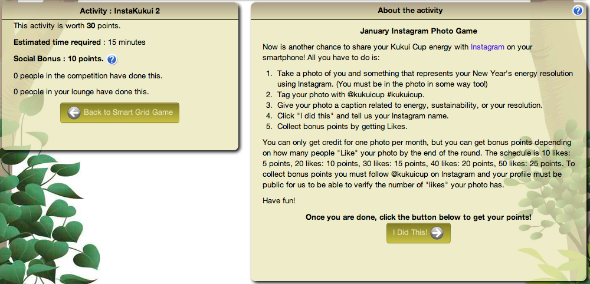

   *Sample creative activity in the Smart Grid Game*

Designing your Smart Grid Game
------------------------------

Designing the Smart Grid Game is one of the most complicated parts of the Kukui Cup
planning process, because the Smart Grid Game is the "portal" through which players get
access to the various "actions" (activities, commitments, events, excursions, and
creatives) of the Kukui Cup: in short, virtually all of the "real world" experiences. 

We recommend that you begin by "roughing out" the design of your smart grid game on paper
(or, even better, in a spreadsheet).   Once you have designed the preliminary set of
actions and their locations in the grid, you can implement that design in the system. 

.. note:: We are working on a SGG "designer" interface with drag-and-drop functionality
   that will greatly simplify this process.  We hope to release it in Q2 of 2013.

Step 1: Design your initial content
***********************************

To design an SGG, the first step is to determine the initial content for your challenge, which
means answering the following questions:

  * What are the events (if any) in your challenge?
  * What are the excursions (if any) in your challenge?
  * What are the commitments (if any) in your challenge?
  * What are the videos (if any) in your challenge?
  * What are the non-video activities in your challenge? 
  * How many points is each activity worth?
  * For video and non-video activities, what are the verification questions?

To help bootstrap your design, we have created an action library of almost 100 actions
that you can use for inspiration.  They are organized as a Google Spreadsheet with various
subsheets to show different perspectives on the information.  The following figure shows a
screen image of the spreadsheet. Here is a link to the `action library`_.

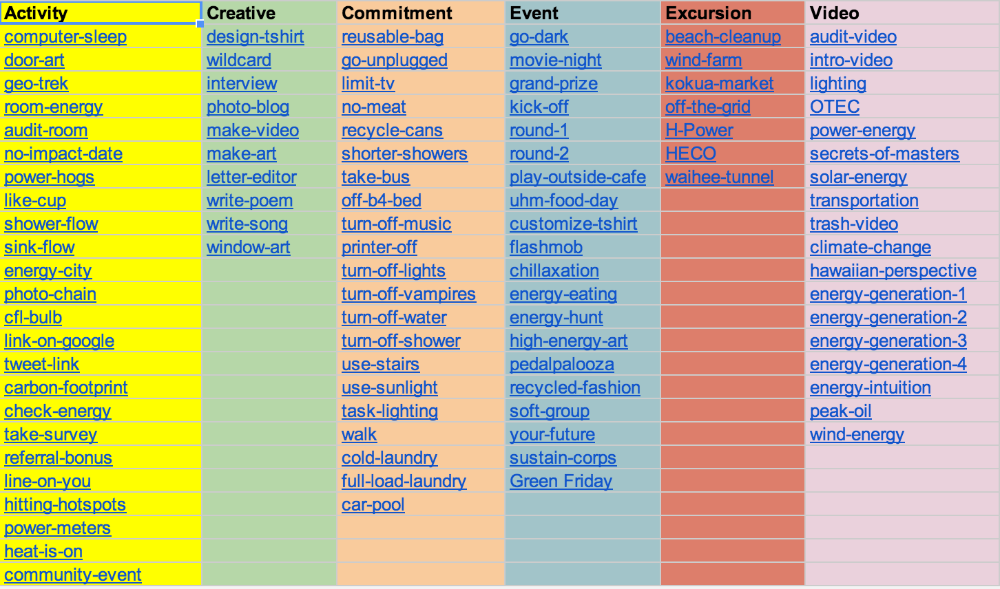
   
   A screenshot of the action library

.. _action library: https://docs.google.com/spreadsheet/ccc?key=0An9ynmXUoikYdE4yaWRPVTlZdTg2Y1V5SWNTeUFjcWc#gid=2

Versions of these actions are also provided in the default configuration of Makahiki, so
you don't have to retype all of the information if you would like to use one or more of
these actions in your challenge.

*To complete this design step*: create a document that provides the titles, descriptions,
point values, and verification questions for all of your proposed
content.   If you are reusing actions from the library, then just list the title and any
attributes that you wish to change.

Step 2: Design the "paths" that players take through the SGG
************************************************************

To make your SGG more interesting to players, and more pedagogically sophisticated, you
will want to define "paths" through the content.   In most cases, when a new player sees
the SGG for the first time, there should only be a few actions available to
them---possibly only one.   All of the rest should be "locked".   

For this design step, start by specifying the initial, "seed" actions in your SGG: those that are always unlocked.

Next, specify the actions that should be unlocked once one or more of the seed actions
are successfully completed by players.  The content of these new actions can now
potentially depend upon the information presented in the initial actions, since the game
itself guarantees that players will have completed "dependent" actions before being
able to see the new action.   

An alternative way to specify that an action should be unlocked is by time and date.  For
example, you may want to make events and excursions visible to participants starting five
days before their actual occurrence.   You can also combine the two approaches.  For
example, you might want to make an event available only to those players who have
successfully completed certain actions.  In this case, it gets unlocked for a player only if both the
date/time has been reached, and the player has completed the actions. 

*To complete this design step:* Augment the document created in Step 1 with the
dependencies associated with each action.  If an action has no dependencies, it is a
"seed" action and will be always unlocked. 

Step 3: Decide which activities support the "social bonus"
----------------------------------------------------------

The social bonus is an optional attribute of any Smart Grid Game action which awards extra
points if the player has done the action with someone else. Examples of actions which
commonly include a social bonus are: attending an event, recording a song related to
energy, or measuring a shower water flow rate.

When a player submits a response for a action that supports the social bonus, the player
can provide the email address another player who jointly completed the action. Once the
other player also completes the task, the social bonus is awarded.  Social bonuses are not
bi-directional; if the second player doesn't provide the first player's email address,
only the first player will get the social bonus.

*To complete this design step:*  Decide which actions should include the social bonus, and
augment your document with this information.

Step 4: Design the layout
*************************

Now that you have the initial set of actions and their dependencies, it is time to figure
out how they should appear in the grid.   A spreadsheet program is quite useful in this
process, or you can use graph paper, or even a piece of paper in which you have drawn
vertical lines to create a grid. In any case, you need to decide on the column labels
(categories), and the column of actions underneath each category. If you are designing a
game with multiple Levels, then you need to decide on the categories and actions for each
level. 

Note that you frequently don't have a "perfect" number of actions to create a rectangular
grid.  To solve this problem, the SGG allows you to specify "Filler" cells in order to
create a rectangular grid. For example, let's say you want to define a Level with 17
actions.  You could create a 4 x 5 grid with your 17 actions and 3 additional "Filler"
actions.  While the SGG allows you to create grids with a "ragged" bottom edge, we think
that a rectangular grid is aestheticly more pleasing.   In addition, Filler cells can be
later replaced by actual actions, enabling you to easily add content in the middle of a
challenge without changing the structure of the grid.

Here are some layout heuristics we have discovered through the design and execution of our
own challenges:

  * Initial, unlocked (seed) actions generally go in the first Level, in the first column.
    The intro video (used during the "first login wizard") is typically the
    first action in the upper left corner.

  * For best display on mobile devices, define no more than 5 categories per Level.

  * To simplify addition of actions after the challenge is started, it is useful to always
    have a few Filler actions on each Level.

  * If you are creating a challenge with multiple rounds, you might want to have one Level
    per round, and have each Level unlock at the start of its corresponding round.

*To complete this design step:* Create a grid using a spreadsheet or paper that contains
your layout.  Each action should appear once and only once on the grid.  If you define
multiple Levels, you need to create a separate grid for each Level.

Implementing your Smart Grid Game with the Designer
---------------------------------------------------

Once you have finished with the design of your Smart Grid Game, it is time to implement it
in the system.  

The Smart Grid Game Designer introduces two new concepts to the Smart Grid Game, a library and the designer. You already know about Activities, Commitments, and Events.

The Smart Grid is live, players can see the Smart Grid Game. If the designer want to change the Smart Grid Game they shouldn't directly edit the Smart Grid since the players can see any changes in real time.
To get around this issue the Designer introduces the concepts of a Library and the Designer.  

   * The Library holds the generic actions without any dates or locations. The Library is a resuable set of actions for any Kukui Cup.
   
   * The Designer holds specific grids that can be published to the Smart Grid Game. Designer Actions have dates and locations.  Designers can adjust the Designer Grid, adding or removing actions, columns and levels and players will not see the changes until they are published. 

Draging a Library item into the Designer Grid creates a new Designer item from the Library item. Currently we don't have a way of dragging a Designer item into the Library.

Makahiki has a Smart Grid Game Designer to help you build your Smart Grid Game. To get to the
Designer click on the "sgg conf" button on the Navigation bar.  The right hand most icons shown
the figure below. 

 
The Smart Grid Game Designer (Designer) has two rows, Designer Widget and Smart Grid Game Validation tools. 

Designer Widget
***************
The first row is the Smart Grid Game Designer Widget shown in the next figure.

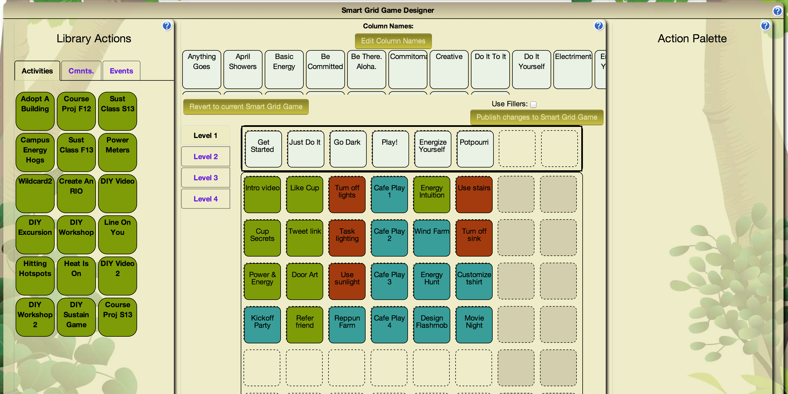

The Designer Widget has three columns, Library Actions, Designer Grid, and Palette.  The Library 
Actions Column holds a library of Activities, Commitments, and Events. These actions are sorted
into three tabs, Activities, Cmnts, Events, shown in the next figure.

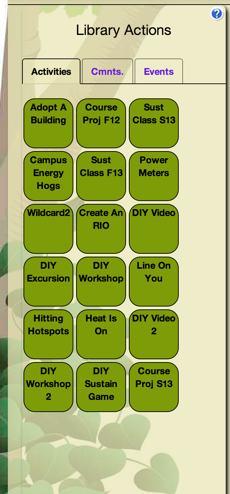

These are actions we've used in previous Kukui Cups and are good examples.  Clicking on the name
of an action takes you to the admin interface where you can edit the action. 

.. note:: If you edit the action and hit save you will not return to the Designer page.  Use the Navbar to return to the Designer. 

You can drag these library actions into the Designer Grid. 

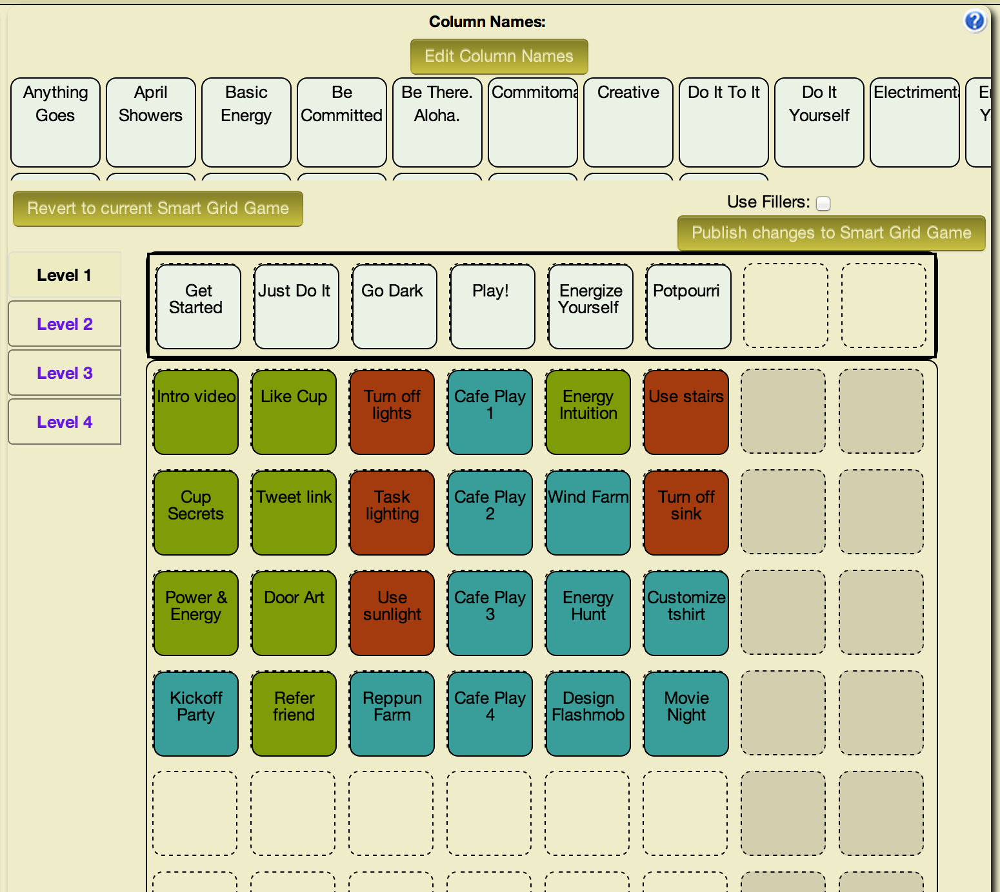

The Designer Grid has three sections, library column names, control buttons, and grid. 

 * The Library Column Names holds the predefined column names we've used in previous Kukui Cups.  You can drag these columns to the grid activating the column.

 * The control buttons allow you to revert to the current Smart Grid Game or Publish the contents of the Designer to the Smart Grid Game.

   - Reverting to the current Smart Grid Game erases the contents of the Designer and copies the Smart Grid Game into the Designer.

   - Publishing the Designer clears the Smart Grid Game and loads it with the contents of the Designer.  The Smart Grid Game is live any players will immediately see the changes to the Smart Grid Game. The 'Use Fillers' checkbox allows you to fill the empty spaces in the grid with "Filler" squares.
   
 * The Grid represents the Smart Grid Game. Levels are on the left (They are at the top of the Smart Grid Game).  Each level has up to eight columns and eight rows holding the grid of actions. Clicking on the column names or grid actions takes you to an editor. Again note if you hit save you are not returned to the Designer.   
 

The third column of the Designer Widget is the Action Palette.  The Action Palette hold Actions that are not currently in the Smart Grid Game, but may be used at a later time.  It is also useful for moving an action from one level to another.

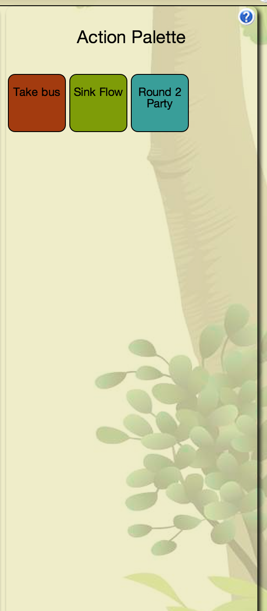

Smart Grid Game Validation Tools
********************************
The second row is a set of Smart Grid Game Validation Tools shown in the next figure.

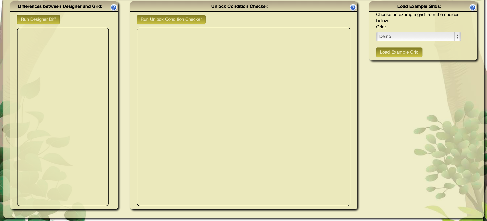

The three validation tools are Designer Difference, Unlock Condition Checker, and Load Example Grid.

* Designer Difference: Pressing the 'Run Designer Diff' button causes Makahiki to compare the Designer Grid and the current Smart Grid. Makahiki presents results of the comparison in the box below the button.

* Unlock Condition Checker: Pressing the 'Run Unlock Condition Checker' button tells Makahiki to check the unlock conditions of the Designer Grid. Makahiki presents the results in the box below the button. The checker tells you if there are any actions that cannot be unlocked, actions who depend on actions in a higher level, and actions with bad dates.

* Load Example Grid: This tool allows you to load different example Smart Grids.  Loading an example grid deletes the current content of the Designer.

Using The Smart Grid Game Designer
**********************************
The easiest way to use the Smart Grid Game Designer is to start with the current Smart Grid contents. Press the "Revert to current Smart Grid Game" button. This will load the current Smart Grid into the Designer.

**Editing Levels:**

* Right mouse click on any of the Levels to get a popup menu. The menu allows you to delete the current level or create a new level. 

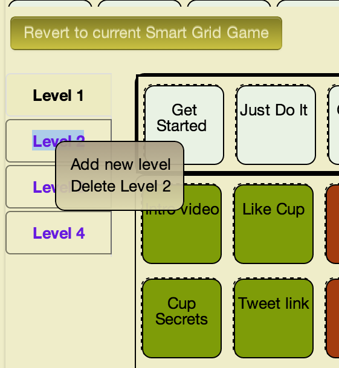
 
 
- Deleting a level moves all the actions in the level to the palette.
  
- Adding a new level creates an empty level. Just supply the unique new level name.

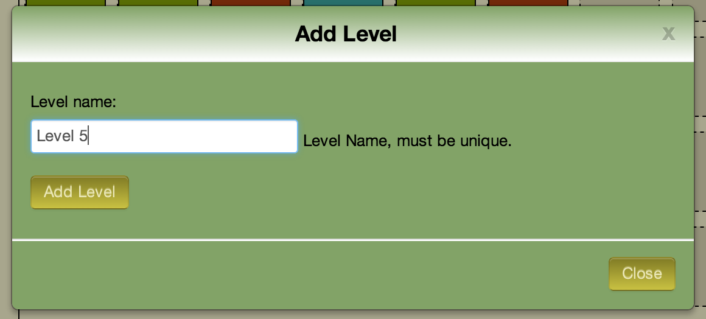
 
 
**Filling a new level:**

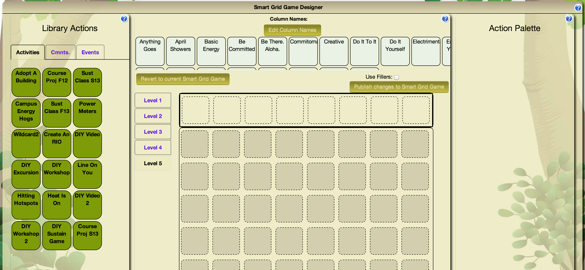
 
1. Drag a column name to the first row of the Designer Grid. This will enable the column. Column names must be unique per level. Keep dragging column names untill you are satisfied with the columns.

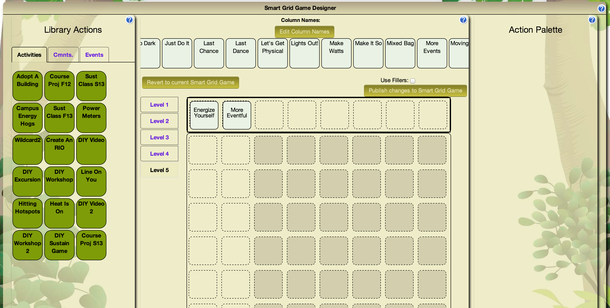
 
2. Drag a Library Activity, Commitment, or Event into the enabled columns.  This will create a Designer Activity, Commitment, or Event. When you drag an Event, Makahiki will ask you for the Event date and location.

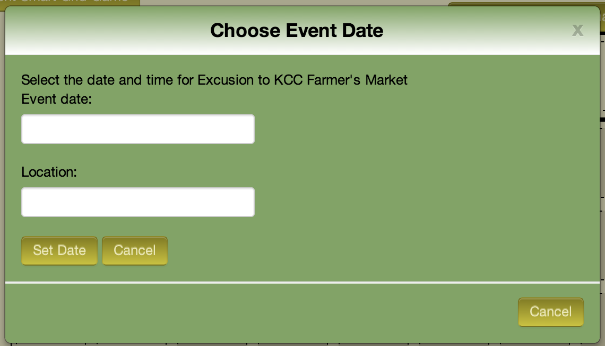
 
The finished level:

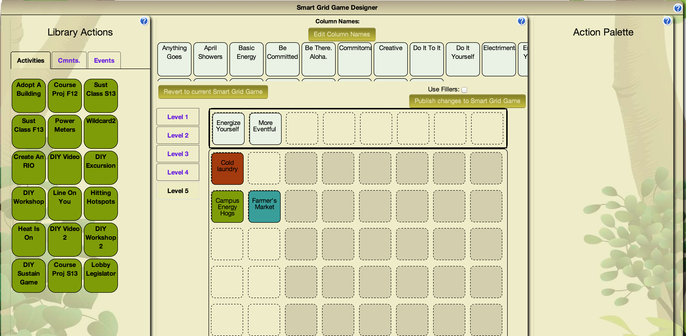
 
3. (Optional, but recommended) Edit the Desginer Actions by clicking on the action names.  Make sure the contents of the actions is what you want. Pay attention to the unlock_conditions.

  
4. Check your Designer Grid by running the Unlock Condition Checker.  Fix any errors. Check the warnings they may be issues or not.

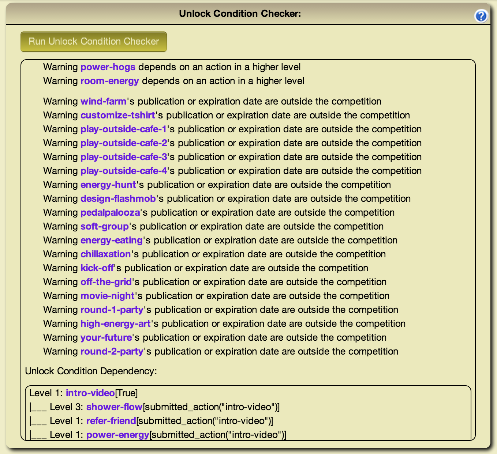
 
  
In this example the event publication dates for many of the events are after the competition ends, so they will not be unlocked during the competition.

Scroll down in the window to see the dependancy tree.

.. figure:: figs/configuration/configuration-game-admin-smartgrid-designer-unlock2.png
   :width: 500px
   :align: center
 

5. Publish your Designer Grid to the Smart Grid Game by pressing the 'Publish changes to Smart Grid Game'.  If you want fillers in your grid make sure the "Use Fillers" checkbox is checked when you publish. Otherwise the empty grid locaiton will be empty in the Smart Grid Game.

Verifying your Smart Grid Game
------------------------------

Once you have implemented your SGG, it is good to "playtest" the game.  Go through each of
the actions, and make sure they display correctly.  Complete the initial actions to make
sure that new actions get unlocked appropriately.  

For large scale challenges, we recommend that you run a prior "pilot" challenge in which you select just a few
people to play through the game and look for problems with your design. 

**Coming Soon** Designer play tester.